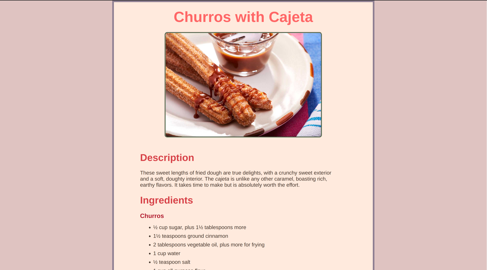

# Project: Recipes

## Project Preview

 

:link: A **live demo** of this project can be found
[here](https://potaytocheeps.github.io/odin-recipes/). 

## Description

This is my implementation of the
[Recipes Project](https://www.theodinproject.com/lessons/foundations-recipes)
from [**The Odin Project**](https://www.theodinproject.com/) curriculum in the HTML
Foundations section of the Foundations course.

It is the first project from The Odin Project curriculum, and it consists of
putting into practice all of the basic HTML elements that have been covered so
far. This project also helps in gaining a better understanding of the basic Git
workflow that will be needed when working on future assignments and projects
that are part of the curriculum.

## Features

This project contains four different static web pages, with the index web page
having links to the other three. Each of the three pages linked contain a different
recipe. Each recipe includes an image and a brief description of it, as well as the
ingredients and steps needed to complete it. This project is meant as a simple
practice to get started in learning the basics of HTML and CSS to structure and
stylize our content.

## Concepts Applied

Working on this project, I put into practice a few of the basic HTML elements
taught in The Odin Project curriculum up to this point. These elements being:

- Headings
- Paragraphs
- Links
- Images
- Ordered and unordered lists

Additionally, the first iteration of the project, which consisted of only the
structure of the content, was later revisited to add styles in order to make it
more visually appealing. When working with the CSS, I played around with the
color theme and the layout of the website to achieve a better, consistent look
for each of the web pages.

## Reflection

Once having finished working on this project, I was able to have a better
understanding of the basic workflow of working with HTML and CSS in order to
create a simple, static website to display content in an appealing and cohesive
manner. I was also able to gain a better understanding of working with Git and
GitHub to maintain local and remote records of the changes that I have made while
working through the project.
